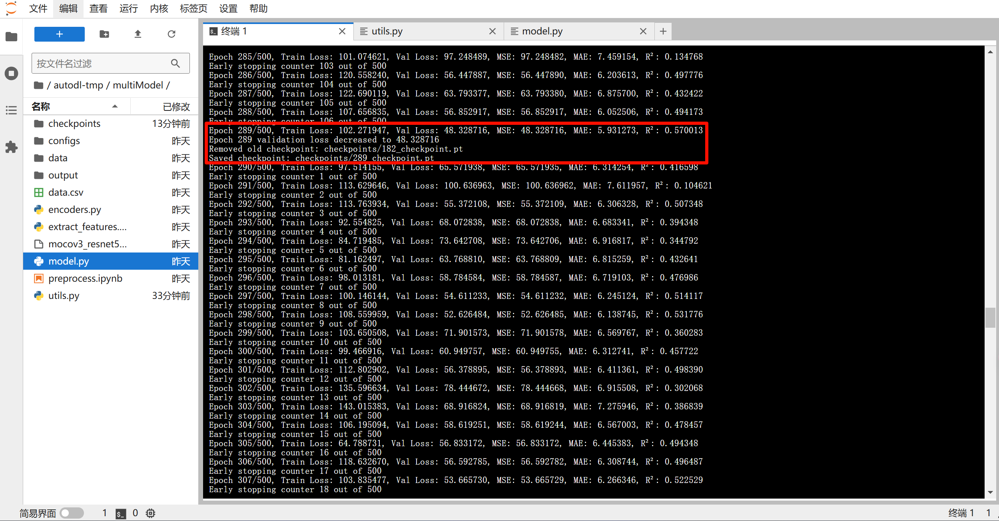
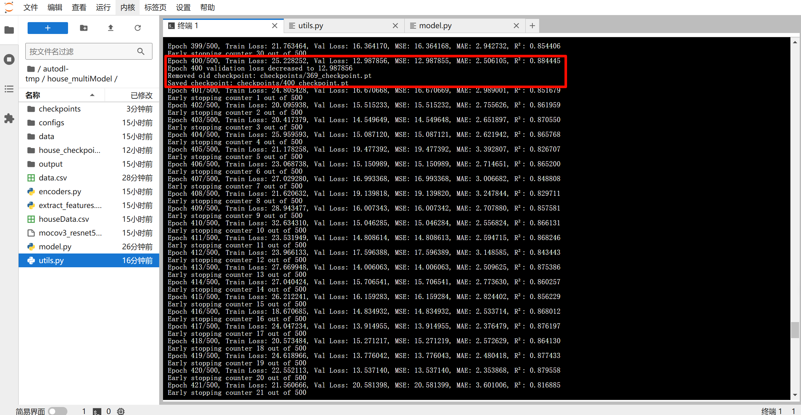
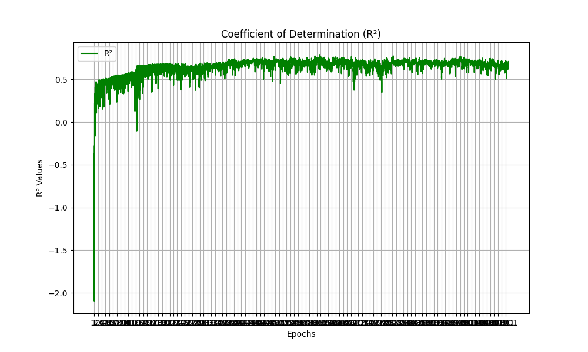
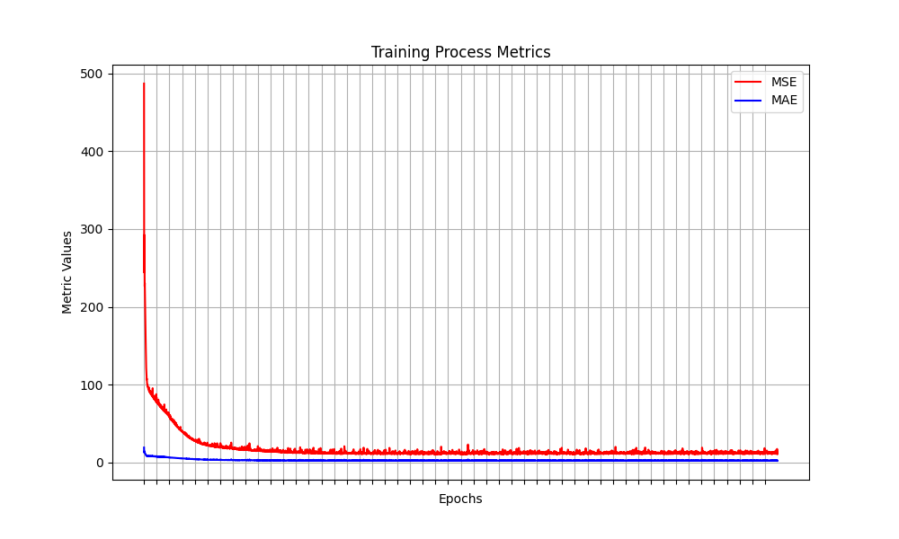
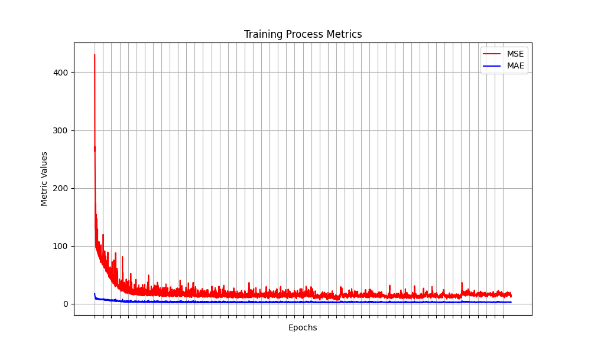

# 1. 环境配置

- 虚拟环境配置（仅用于测试代码是否运行成功而非训练使用）：


- 环境更新：mmcv 在python 3.8——3.11，3.12支持不好，需要降到3.12以下，因此更换镜像将环境降到3.10：
  

---

# 2. 安装依赖库
```bash
pip install opencv-python
pip install numpy
pip install shapely
pip install scikit-learn
pip install pillow
pip install matplotlib
pip install scikit-image tifffile

pip install -U openmim
mim install mmengine
mim install mmcv>=2.0.0
pip install mmpretrain
```

---

# 3. 代码

### 预训练使用模型
[使用 2024 年的 genview 模型](https://huggingface.co/Xiaojie0903/genview_pretrained_models/tree/main)


### 3.1 预训练文件
- `preprocess.ipynb`
- `extract_features.py`
- `encoders.py`

**图片特征提取的运行命令：**
  *(checkpoints文件和代码处于同一级目录)*
```bash
python extract_features.py \
  --input_image input_images/preprocess_demo.png \
  --checkpoint mocov3_resnet50_8xb512-amp-coslr-100e_in1k_genview.pth \
  --model_type genview_resnet50 \
  --tile_size 512 \
  --overlap 128 \
  --batch_size 32 \
```

### 3.2 训练预测文件
- `utils.py`
- `models.py`

### 3.3 模型函数说明
1. AttnNet
   - 针对单模态内部做多实例注意力聚合：给每个 patch/切片加权后再聚合，用来突出重要区域或局部特征。
2. Attn_Modality_Gated
   - 在两模态之间做互相门控，学习到一方特征如何抑制/加强另一方信息，从而得到更具交互性的特征表征。
   - 详细说明
     - 文本特征输入后，经过 linear_h1 线性映射和 ReLU 激活，得到中间特征 h1，然后使用 linear_z1 计算门控信号 z1(通过双线性层同时处理文本特征和图像特征)，经过 Sigmoid 函数映射到 [0,1] 区间，得到调制系数,与 h1 元素级相乘，再经过 linear_o1（包括线性映射、ReLU 和 Dropout）生成最终输出 o1，即经过调整后的文本特征
     - 两种模态的特征输入，对其进行线性变换和ReLU激活函数，分别得到两个对应的中间特征hi，然后通过双线性层，即通过 Output = x^T · W · y + b 这个公式，W权重矩阵随机初始化后，根据训练过程中反向传播算法不断调整，收敛至能够最好捕捉输入之间交互关系的数值，然后输出计算后的一个新的表示向量（若x形状为(N,n)，y形状为(N,m)，输出向量形状为(N,p)，p为指定的输出维度），然后将这个表示向量经过 Sigmoid 函数映射到 [0,1] 区间，从而得到调制系数，再将这个调制系数即门控权重和前面的中间特征hi元素级相乘，再经过线性变换、ReLU激活函数和Dropout随机丢弃一些神经元防止过拟合，从而最终得到经过另一种模态特征影响的本模态特征
3. FC_block
   - 仅是一个线性 + 激活 + dropout 的简单封装，方便反复使用，在主模型里可以将这种常见操作进一步抽象出来。
4. Kron vs. Concat
   - Concat：拼接到一起，简单高效，表达力有限，输出维度较小（线性增加）。
   - Kron：构造了 (dim1 * dim2) 维，显式捕捉所有 pairwise 交互，表达力更高，维度暴涨，资源消耗更大。

---

# 4. 开发日志

### 2025.1.20
1. preprocess.ipynb 图像预处理调整并运行成功，图像如下：


2. 使用 AI 调整完成大部分流程，包括`encoders.py`、`extract_features.py`、`models.py`、`utils.py`

### 2025.1.23
1. 修复 GitHub 提交问题，在保证代码更新不变前提下丢失了近5条推送记录(╥﹏╥)，重新提交

2. 由于原论文中 EsViT 中提供的 checkpoints 无法下载，通过调研使用2024新模型 genview 

3. 嵌入 genview 模型
  - 调整完成模型预训练和图片特征提取部分，使用 genview 模型 ([GitHub 地址](https://github.com/xiaojieli0903/genview/))
  - 模型使用的checkpoints为 Hugging Face 中提供的checkpoints，如图所示：
    

4. 成功提取灰度图片特征，将其保存为output/genview_features.npz 用于后续训练。
   当前特征维度：{features: (9, 524288), coords: (4, 9), img_shape: (2,), model_type: ()}
  - `features`: (9, 524288) 表明提取的特征矩阵有 9 个分块，每个分块的特征维度为 524288。
  - `coords`: (4, 9) 提供了每个分块的坐标信息（如分块在原始图像中的位置）。
  - `img_shape`: (2,) 描述了输入图像的形状，应该是 (高度, 宽度)。
  - `model_type`: () 表示使用的模型类型（可能在保存时未正确写入）。
  
5. 文本数据预处理（类型及类别数量统计，以便后续处理）

| 字段名称         | 数值类型        | 离散值类别数量          |
|------------------|---------------|-----------------|
| 混凝土强度等级   | 离散值           | 10类    |
| 胶材总量（kg/m³）| 连续值           | -       |
| 水胶比           | 连续值          | -        |
| 水泥品种         | 离散值          | 3类      |
| 水泥型号         | 离散值          | 3类      |
| 水泥（kg/m³）    | 连续值          | -        |
| 粉煤灰掺量（%）  | 连续值          | -        |
| 矿粉掺量（%）    | 连续值          | -        |
| 硅灰掺量（%）    | 连续值          | -        |
| 其余胶材（%）    | 连续值          | -        |
| 减水剂（%）      | 连续值          | -        |
| 砂率             | 连续值         | -        |
| 石子（kg/m³）    | 连续值          | -        |
| 石子级配         | 离散值          | 3类      |
| 抗裂剂（%）      | 连续值          | -        |
| 抗裂剂掺加方式   | 离散值          | 3类      |
| 抗裂剂型号       | 离散值          | 10类     |
| 龄期             | 连续值          | -        |
| 强度             | 连续值          | -        |

### 2025.1.24
1. 更改 `extract_features.py` 逻辑，使其能够支持对多张图片进行特征提取，提取特征保存为 `output/{slide_id}_features.npz`，并重命名测试图片为 `1.png`

2. 更改`utils.py`文件，使其能够符合混凝土的输入格式，当前训练预测的命令为：
  
  ```bash
  python utils.py \
      --data_path data.csv \
      --categorical_columns "混凝土强度等级" "水泥品种" "水泥型号" "石子级配" "抗裂剂掺加方式" "抗裂剂型号" \
      --continuous_columns "胶材总量（kg/m³）" "水胶比" "水泥（kg/m³）" "粉煤灰掺量（%）" "矿粉掺量（%）" "硅灰掺量（%）" "其余胶材（%）" "减水剂（%）" "砂率" "石子（kg/m³）" "抗裂剂（%）" "龄期" \
      --target_column "强度" \
      --test_size 0.2 \
      --random_state 42 \
      --batch_size 32 \
      --num_workers 4 \
      --num_epochs 100 \
      --log_dir checkpoints
  ```
  参数说明：
  - data_path：CSV 数据文件路径。
  - categorical_columns：离散值字段列表，需用空格分隔字段名称。
  - continuous_columns：连续值字段列表，需用空格分隔字段名称。
  - target_column：目标值字段名称。
  - test_size：测试集比例（默认 0.2）。
  - random_state：随机种子（默认 42）。
  - batch_size：训练批次大小（默认 32）。
  - num_workers：数据加载器的线程数（默认 4）。
  - num_epochs：训练的总轮数（默认 100）。
  - log_dir：模型保存路径（默认 checkpoints）。

3. 更改`models.py`文件，使其能够符合混凝土的输入格式，由于此次模型的更改，上述第二条中`utils.py`的代码和运行命令也需要更改，已更改，尚未运行测试
  ```bash
  python utils.py \
    --data_path "data/concrete_data.csv" \
    --categorical_columns "混凝土强度等级" "水泥品种" "水泥型号" "石子级配" "抗裂剂掺加方式" "抗裂剂型号" \
    --continuous_columns "胶材总量（kg/m³）" "水胶比" "水泥（kg/m³）" "粉煤灰掺量（%）" "矿粉掺量（%）" \
    "硅灰掺量（%）" "其余胶材（%）" "减水剂（%）" "砂率" "石子（kg/m³）" "抗裂剂（%）" "龄期" \
    --target_column "强度" \
    --test_size 0.2 \
    --random_state 42 \
    --batch_size 32 \
    --num_workers 4 \
    --num_epochs 100 \
    --log_dir "checkpoints"
  ```
  参数说明：
  - data_path：CSV 数据文件路径。
  - categorical_columns：离散值字段列表，需用空格分隔字段名称。
  - continuous_columns：连续值字段列表，需用空格分隔字段名称。
  - target_column：目标值字段名称。
  - test_size：测试集比例（默认 0.2）。
  - random_state：随机种子（默认 42）。
  - batch_size：训练批次大小（默认 32）。
  - num_workers：数据加载器的线程数（默认 4）。
  - num_epochs：训练的总轮数（默认 100）。
  - log_dir：模型保存路径（默认 checkpoints）。

### 2025.2.3
1. 修改`model.py`的问题：
    - 主模型默认特征维度和图片实际特征维度不一致，应改为**524288**
    - 当前仍然使用**kron**乘积融合，但是可能会导致维度爆炸的问题，可能需要修改为**concat**融合，当前仍然为**kron**乘积融合

### 2025.2.4
1. 将文本数据格式从`xlsx`转换为`csv`，从而匹配代码格式
2. 修改utils.py文件代码，使其能够解析输出的参数命令，并将独热编码改为标签编码（因为在多模态模型中无需使用独热编码防止高维空间距离错误，仅需要通过标签编码嵌入模型）
3. 修改文本数据和图片特征数据的映射关系，每次获取数据时动态加载对应的特征文件
4. 构造包含`slide_id`的假文本数据`data_419.csv`（仅三行），同时对应图片特征均为同一份图片特征拷贝三份重命名得到的
5. 由于原来构造的csv格式的数据不是UTF-8格式，因此需要将`data_419.csv`转换为UTF-8格式，转换后的文件名为`data_419_utf8.csv`
6. 当前存在模型运行计算过程中维度不匹配问题

  运行命令：
  ```bash
  python utils.py \
    --data_path "data_419_utf8.csv" \
    --categorical_columns "Strength of Cement" "Gradation of concrete" "Type of water reducer" "Type of air entrainer" "cement admixture" \
    --continuous_columns "Content of cement (kg/m3)" "Cement/water" "Dosage of FA(%)" "Sand rate" "Dosage of water reducer (%)" "Dosage of air entrainer (%)" "The temperature of concrete(℃)" "The temperature of air(℃)" "Air content(%)" \
    --target_column "The 28day compressive strength of concrete" \
    --test_size 0.2 \
    --random_state 42 \
    --batch_size 32 \
    --num_workers 4 \
    --num_epochs 100 \
    --log_dir "checkpoints" \
    --feature_dir "output"
  ```

### 2025.2.6——2025.2.10
1. 修改模型的线性层的输入维度和实际传入的数据维度不匹配问题
2. 模型运行基本成功（调试使用的服务器内存太小，运行后系统盘爆满）
   

### 2025.2.12
查看混凝土微观图像，明确应该识别的图像特征
1. 白色——水泥熟料——关键强度指标——含量与强度负相关
2. 黑色圆形——粉煤灰——当前不考虑
3. 黑色——C-S-H——含量与强度正相关

### 2025.2.13——2025.2.14
使用VCCTL软件模拟构造100个混凝土微观图像，见`data/xxx.png`

### 2025.2.15
1. 使用模拟构造的图像数据进行初步实验预测
2. 更换文本数据，因此运行命令改为：
```bash
  python utils.py \
    --data_path "data.csv" \
    --continuous_columns "slide_id" "水用量（kg/m3）" "水泥矿物组分_C3S（%）" "水泥矿物组分_C2S（%）" "水泥矿物组分_C3A（%）" "水泥矿物组分_C4AF（%）" "胶砂抗压_7d（MPa）" "胶砂抗压_28d（MPa）" "胶砂抗折3d（MPa）" "胶砂抗折7d（MPa）" "胶砂抗折_28d（MPa）" "水化热_1d（J/g）" "水化热_3d（J/g）" "水化热_7d（J/g）" "水泥用量（kg/m3）" "FA化学组分_SiO2（%）" "FA化学组分_Al2O3（%）" "FA化学组分_Fe2O3（%）" "FA化学组分_CaO（%）" "粉煤灰用量（kg/m3）" "砂表观密度（kg/m3）" "砂用量（kg/m3）" "石1坚固性（%）" "石1压碎指标（%）" "石1用量（kg/m3）" "石2坚固性（%）" "石2压碎指标（%）" "石2用量（kg/m3）" "石3坚固性（%）" "石3压碎指标（%）" "石3用量（kg/m3）" "外加剂1用量（%）" "外加剂2用量（%）" \
    --target_column "28d抗压强度" \
    --test_size 0.2 \
    --random_state 42 \
    --batch_size 32 \
    --num_workers 4 \
    --num_epochs 100 \
    --log_dir "checkpoints" \
    --feature_dir "output"
```

3. 当前文件夹中文件组织如图所示
   

4. 文件说明：
   - `data.csv`——混凝土配合比数据，如 "胶砂抗压_28d（MPa）" "胶砂抗折3d（MPa）" 等
   - `data` 文件夹——存放模拟构造的混凝土微观图像
   - `input` 文件夹——存放最初测试特征提取的图片
   - `output` 文件夹——存放最终提取的特征
  
5. 图片特征提取运行命令：
 ```bash
  python extract_features.py \
    --input_image data/1.png \
    --checkpoint mocov3_resnet50_8xb512-amp-coslr-100e_in1k_genview.pth \
    --model_type genview_resnet50 \
    --tile_size 512 \
    --overlap 128 \
    --batch_size 32 \
  ```
6. 更改`extract_features.py`文件的main函数，使其能够自动对文件夹中的所有图像进行特征提取而无需手动指定（当然也可以手动指定）
   更新后的运行命令如下：
```bash
  python extract_features.py \
    --input_image data \
    --checkpoint mocov3_resnet50_8xb512-amp-coslr-100e_in1k_genview.pth \
    --model_type genview_resnet50 \
    --tile_size 512 \
    --overlap 128 \
    --batch_size 32 \
```

7. 由于更新后的文本数据不存在离散值，因此需要对`utils.py`文件和`model.py`文件进行修改，使其能够正确运行
8. 同时由于仅模拟生成了100个图像，`data.csv`文件中数据过多，需要删除部分数据仅保留前100个，而全部数据命名为`data_all.csv`
9. 由于checkpoints太多导致磁盘爆满，因此更新checkpoints的保存原则，改为仅保留10个checkpoints，新来的checkpoints替换掉最旧的checkpoints
10.  由于测试最初结果不是很理想，因此计划使用房屋数据进行测试，检测是否代码原因导致效果不好
    

### 2025.2.16
1. 房屋数据集上的运行命令：
     运行命令：
  ```bash
  python utils.py \
    --data_path "houseData.csv" \
    --categorical_columns "卧室数量" "浴室数量" "邮编" \
    --continuous_columns "面积" \
    --target_column "价格" \
    --test_size 0.2 \
    --random_state 42 \
    --batch_size 32 \
    --num_workers 4 \
    --num_epochs 100 \
    --log_dir "checkpoints" \
    --feature_dir "output"
  ```
  当前房屋多模态数据集最佳预测结果：
  

2. 当前混凝土多模态数据集最佳预测结果:
   

### 2025.2.17
1. 调整epoch为500，运行命令为：
```bash
  python utils.py \
    --data_path "data.csv" \
    --continuous_columns "slide_id" "水用量（kg/m3）" "水泥矿物组分_C3S（%）" "水泥矿物组分_C2S（%）" "水泥矿物组分_C3A（%）" "水泥矿物组分_C4AF（%）" "胶砂抗压_7d（MPa）" "胶砂抗压_28d（MPa）" "胶砂抗折3d（MPa）" "胶砂抗折7d（MPa）" "胶砂抗折_28d（MPa）" "水化热_1d（J/g）" "水化热_3d（J/g）" "水化热_7d（J/g）" "水泥用量（kg/m3）" "FA化学组分_SiO2（%）" "FA化学组分_Al2O3（%）" "FA化学组分_Fe2O3（%）" "FA化学组分_CaO（%）" "粉煤灰用量（kg/m3）" "砂表观密度（kg/m3）" "砂用量（kg/m3）" "石1坚固性（%）" "石1压碎指标（%）" "石1用量（kg/m3）" "石2坚固性（%）" "石2压碎指标（%）" "石2用量（kg/m3）" "石3坚固性（%）" "石3压碎指标（%）" "石3用量（kg/m3）" "外加剂1用量（%）" "外加剂2用量（%）" \
    --target_column "28d抗压强度" \
    --test_size 0.2 \
    --random_state 42 \
    --batch_size 32 \
    --num_workers 4 \
    --num_epochs 500 \
    --log_dir "checkpoints" \
    --feature_dir "output"
```
结果仍然不太理想，目前没训完最佳R²: 0.54410


训完最佳R²: 0.570013


1. 使用纯文本表格数据进行预测，最佳R²: 0.884445
   

2. 将`extract_features.py`文件中灰度图的特征提取改为RGB图的特征提取
   
3. 将`utils.py`文件中加入使用GPU训练
   
4. 将`model.py`文件中kron融合方式替换为concat融合方式，并改为RGB图像特征提取，最佳R²: 0.528388
   

5. 改为RGB图像特征提取，kron融合方式，最佳R²: 0.611724
   

6. 将百分比数据换为小数，如 54% -> 0.54，处理后的数据为`data_processed.csv`
   
  ```bash
  python utils.py \
    --data_path "data_processed.csv" \
    --continuous_columns "slide_id" "水用量（kg/m3）" "水泥矿物组分_C3S（%）" "水泥矿物组分_C2S（%）" "水泥矿物组分_C3A（%）" "水泥矿物组分_C4AF（%）" "胶砂抗压_7d（MPa）" "胶砂抗压_28d（MPa）" "胶砂抗折3d（MPa）" "胶砂抗折7d（MPa）" "胶砂抗折_28d（MPa）" "水化热_1d（J/g）" "水化热_3d（J/g）" "水化热_7d（J/g）" "水泥用量（kg/m3）" "FA化学组分_SiO2（%）" "FA化学组分_Al2O3（%）" "FA化学组分_Fe2O3（%）" "FA化学组分_CaO（%）" "粉煤灰用量（kg/m3）" "砂表观密度（kg/m3）" "砂用量（kg/m3）" "石1坚固性（%）" "石1压碎指标（%）" "石1用量（kg/m3）" "石2坚固性（%）" "石2压碎指标（%）" "石2用量（kg/m3）" "石3坚固性（%）" "石3压碎指标（%）" "石3用量（kg/m3）" "外加剂1用量（%）" "外加剂2用量（%）" \
    --target_column "28d抗压强度" \
    --test_size 0.2 \
    --random_state 42 \
    --batch_size 32 \
    --num_workers 4 \
    --num_epochs 5000 \
    --log_dir "checkpoints" \
    --feature_dir "output"
  ```
7. 加入对连续值的归一化步骤，最佳R²: 0.535195
   

8. 彻底去除离散值输入在代码中的影响，使用kron重新训练，最佳R²: 0.577595
   

   在上面这次的基础上载入checkpoint，继续训练，最佳R²: 0.672822
   

### 2025.2.18
1. 加大训练次数，训练10000次，目前最佳**R²: 0.770671**（估计也是最佳状态了，3小时后5600多轮没有一个高于这个的T_T）
   

2. 尝试更改门控，仅允许图像特征根据文本特征的内容动态调整，而不允许文本特征根据图像特征动态调整，仅训练5000轮，  
   训练结束后最佳R²出现在Epoch 3560/5000, Train Loss: 7.174438, Val Loss: 26.866144, MSE: 26.866144, MAE: 4.112032, **R²: 0.760969**  
   下面是5000次训练过程中的训练指标和损失变化曲线  
   
   
   
   
3. 保存训练时损失、评估指标等的图像
   
4. 融合OSF（Orthogonal Sequential Fusion，正交序列融合）思想，参考文献：**Labbaki, Sami** & **Minary, Peter** (2024). *Orthogonal Sequential Fusion in Multimodal Learning*. [阅读原文](https://openreview.net/forum?id=XuNkuoihgG)  
   在保持仅允许图像特征根据文本特征的内容动态调整，而不允许文本特征根据图像特征动态调整，仅训练500轮，直观感受就是损失下降很快，R² 很快就能上升到0.3、0.4的水平，  
   训练结束后最佳R²出现在Epoch 427/428, Train Loss: 11.227631, Val Loss: 52.143616, MSE: 52.143612, MAE: 5.884242, R²: 0.536072

   训练12000轮，由于5000轮未出现更优触发早停机制，训练结束后最佳R²出现在Epoch 5981/10981, Train Loss: 2.905519, Val Loss: 23.483797, MSE: 23.483796, MAE: 3.844087, **R²: 0.791062**  
   
   
   

5. 单独将 R² 画成一个图，方便观察训练过程
   
### 2025.2.19
1.  可以考虑看看纯图像预测效果如何，不允许图像特征根据文本特征调整，  
   训练结束后最佳R²出现在Epoch 4934/5000, Train Loss: 3.982477, Val Loss: 36.994698, MSE: 36.994695, MAE: 4.521901, **R²: 0.670854**  
   
   
   
   
2.  优化绘图坐标标签
   
3.  全关gate使用OSF，  
   训练结束后最佳R²出现在Epoch 3374/5000, Train Loss: 3.986423, Val Loss: 26.212183, MSE: 26.212182, MAE: 3.857293, **R²: 0.766787**  
   
   
   

4.  全开gate使用OSF，  
   训练结束后最佳R²出现在Epoch 3838/5000, Train Loss: 4.231354, Val Loss: 26.858631, MSE: 26.858630, MAE: 4.058580, **R²: 0.761035**
   
   
   

5. 继续模拟图像数据，从原来100张增加至现在的200张
   
6. 使用纯文本表格数据进行预测，图像文本特征互不影响，未使用OSF，训练5000轮后，  
   训练结束后最佳R²出现在Epoch 1819/5000, Train Loss: 13.984750, Val Loss: 2.017839, MSE: 2.017839, MAE: 1.176800, **R²: 0.982047**
   
   
   

7. 尝试使用全部977条数据进行预测，训练10000轮
   前200条数据为图文数据，后877条图像用空张量填充
      
  ```bash
  python utils.py \
    --data_path "data_all_processed.csv" \
    --continuous_columns "slide_id" "水用量（kg/m3）" "水泥矿物组分_C3S（%）" "水泥矿物组分_C2S（%）" "水泥矿物组分_C3A（%）" "水泥矿物组分_C4AF（%）" "胶砂抗压_7d（MPa）" "胶砂抗压_28d（MPa）" "胶砂抗折3d（MPa）" "胶砂抗折7d（MPa）" "胶砂抗折_28d（MPa）" "水化热_1d（J/g）" "水化热_3d（J/g）" "水化热_7d（J/g）" "水泥用量（kg/m3）" "FA化学组分_SiO2（%）" "FA化学组分_Al2O3（%）" "FA化学组分_Fe2O3（%）" "FA化学组分_CaO（%）" "粉煤灰用量（kg/m3）" "砂表观密度（kg/m3）" "砂用量（kg/m3）" "石1坚固性（%）" "石1压碎指标（%）" "石1用量（kg/m3）" "石2坚固性（%）" "石2压碎指标（%）" "石2用量（kg/m3）" "石3坚固性（%）" "石3压碎指标（%）" "石3用量（kg/m3）" "外加剂1用量（%）" "外加剂2用量（%）" \
    --target_column "28d抗压强度" \
    --test_size 0.2 \
    --random_state 42 \
    --batch_size 32 \
    --num_workers 4 \
    --num_epochs 10000 \
    --log_dir "checkpoints" \
    --feature_dir "output"
  ```

  训练结束后最佳R²出现在Epoch 375/5375, Train Loss: 33.395149, Val Loss: 23.846676, MSE: 24.186716, MAE: 3.868034, R²: 0.834725  
  
  
  

### 2025.2.20
1.  将 `data_processed.csv` 中的数据扩充至200条，以方便使用200条图文多模态数据进行训练  
   门控全开（前面的应该都是全开门控，关门控的修改错位置了 T_T），使用OSF，  
   训练结束后最佳R²出现在Epoch 1834/5000, Train Loss: 8.776495, Val Loss: 8.371666, MSE: 7.270442, MAE: 1.985031, R²: 0.939003
   
   
   
   
  ```bash
  python utils.py \
    --data_path "data_processed.csv" \
    --continuous_columns "slide_id" "水用量（kg/m3）" "水泥矿物组分_C3S（%）" "水泥矿物组分_C2S（%）" "水泥矿物组分_C3A（%）" "水泥矿物组分_C4AF（%）" "胶砂抗压_7d（MPa）" "胶砂抗压_28d（MPa）" "胶砂抗折3d（MPa）" "胶砂抗折7d（MPa）" "胶砂抗折_28d（MPa）" "水化热_1d（J/g）" "水化热_3d（J/g）" "水化热_7d（J/g）" "水泥用量（kg/m3）" "FA化学组分_SiO2（%）" "FA化学组分_Al2O3（%）" "FA化学组分_Fe2O3（%）" "FA化学组分_CaO（%）" "粉煤灰用量（kg/m3）" "砂表观密度（kg/m3）" "砂用量（kg/m3）" "石1坚固性（%）" "石1压碎指标（%）" "石1用量（kg/m3）" "石2坚固性（%）" "石2压碎指标（%）" "石2用量（kg/m3）" "石3坚固性（%）" "石3压碎指标（%）" "石3用量（kg/m3）" "外加剂1用量（%）" "外加剂2用量（%）" \
    --target_column "28d抗压强度" \
    --test_size 0.2 \
    --random_state 42 \
    --batch_size 32 \
    --num_workers 4 \
    --num_epochs 5000 \
    --log_dir "checkpoints" \
    --feature_dir "output"
  ```

### 2025.2.21
1. 不使用OSF，门控全开，使用影响后的文本特征进行训练，5000轮，  
   训练结束后最佳R²出现在Epoch 3897/5000, Train Loss: 11.904973, Val Loss: 7.701504, MSE: 10.446014, MAE: 2.198862, R²: 0.912361  
   
   
   

2. 200条数据，gate全关，未使用OSF，训练5000轮，
   训练结束后最佳R²出现在Epoch 4976/5000, Train Loss: 10.231179, Val Loss: 4.970662, MSE: 5.050251, MAE: 1.785816, R²: 0.957630  
   
   
   

3. 200条数据，gate全开，未使用OSF，训练5000轮，  
   训练结束后最佳R²出现在Epoch 1836/5000, Train Loss: 11.003951, Val Loss: 1.702690, MSE: 1.702690, MAE: 1.052739, R²: 0.984851  
   
   
   
   
4. 200条数据，gate全关且注释掉门控相关代码，未使用OSF，model里逻辑改为直接使用仅将text_features进行一次处理`text_cont = self.text_continuous_layer(text_features)`以和预测所用的输入向量维度匹配，训练5000轮，  
   训练结束后最佳R²出现在Epoch 4729/5000, Train Loss: 7.399903, Val Loss: 12.227687, MSE: 11.077335, MAE: 2.504987, R²: 0.907065  
   
   
   
   
5. 由于上面0.984851和之前的0.912361差距太大，因此进行三次实验查看方差（下面这两个都是100的数据集上跑的T_T，重新跑了）
  - 训练结束后最佳R²出现在Epoch 1836/5000, Train Loss: 11.003951, Val Loss: 1.702690, MSE: 1.702690, MAE: 1.052739, R²: 0.984851

  - 训练结束后最佳R²出现在Epoch 1786/5000, Train Loss: 8.846748, Val Loss: 1.988263, MSE: 1.988262, MAE: 1.099349, R²: 0.982310
    
    
    

6. 生成图片，生成至375张，下一个从376开始（即377行）
   
### 2025.2.22
1. 200数据集，gate全开，未使用OSF，训练5000轮，  
   - 训练结束后最佳R²出现在Epoch 3664/5000, Train Loss: 11.983153, Val Loss: 5.962282, MSE: 7.536364, MAE: 2.033414, R²: 0.936772  
      
      
      
   - 训练结束后最佳R²出现在Epoch 2936/5000, Train Loss: 12.558142, Val Loss: 5.542506, MSE: 6.833686, MAE: 2.120836, R²: 0.942668  
     
     
     
   - 训练结束后最佳R²出现在Epoch 4852/5000, Train Loss: 12.662274, Val Loss: 7.113982, MSE: 7.305274, MAE: 2.173342, R²: 0.938711  
     
     
     

2. 200数据集，gate全开，使用OSF，训练5000轮，  
   - 训练结束后最佳R²出现在Epoch 3901/5000, Train Loss: 9.131443, Val Loss: 7.642505, MSE: 7.981929, MAE: 2.226889, R²: 0.933034  
     
     
     
   - 训练结束后最佳R²出现在Epoch 2868/5000, Train Loss: 10.661933, Val Loss: 7.111253, MSE: 6.049787, MAE: 1.911677, R²: 0.949244  
     
     
     
   - 训练结束后最佳R²出现在Epoch 2729/5000, Train Loss: 12.294035, Val Loss: 9.606826, MSE: 9.021677, MAE: 2.368280, R²: 0.924311  
     
     
     

3. 200数据集，gate全关，未使用OSF，训练5000轮，  
   - 训练结束后最佳R²出现在Epoch 4288/5000, Train Loss: 9.396043, Val Loss: 6.835231, MSE: 6.639217, MAE: 1.919623, R²: 0.944299  
     
     
     
   - 训练结束后最佳R²出现在Epoch 4670/5000, Train Loss: 6.763716, Val Loss: 5.827636, MSE: 6.284105, MAE: 1.880161, R²: 0.947278  
     
     
     
   - 训练结束后最佳R²出现在Epoch 4894/5000, Train Loss: 9.066399, Val Loss: 4.892933, MSE: 5.652089, MAE: 1.828994, R²: 0.952581  
     
     
     

4. 生成图片，生成至550张，下一个从551开始（即552行）

### 2025.2.23
1. 图片生成到850张，下一个从851开始（即852行）

### 2025.2.24
1. 977张图像生成完毕

